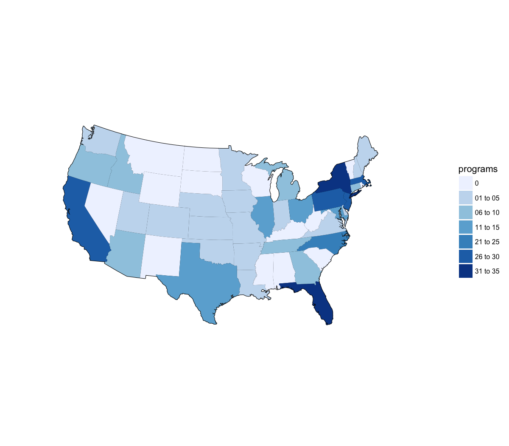

## Why work with maps?  

Over the last two years, a number of students have included "spacial analysis" as part of the professional project proposals. Examples include:

- prevalence of lead in blood samples, compared by zip codes 
- examination of lead in municipal water samples 
- mapping the spatial patterns of the salt through time and the geospatial resources of the greater Bonneville Salt Flats research initiative
- evaluating the effectiveness of a watershed restoration plan
- trail activity and its effects on Flammulated Owl breeding populations in Snow Basin Utah

## What are my options?  

Fortunately, there are several options available to display 

- **ggplot2 Esentials** (Chapter 7: ggplot2 and maps)
- [Making Maps with R](http://eriqande.github.io/rep-res-web/lectures/making-maps-with-R.html)
- [**ggmap : Spatial Visualization with ggplot2**](http://stat405.had.co.nz/ggmap.pdf)

***


## Example of a common map (USGS)  

[Public Supply Water Use](https://water.usgs.gov/watuse/wups.html)  
  

Map details can be found at https://water.usgs.gov/watuse/wups.html  
***

## Example of a common map (PSM)  

{ hight=25% }  

(Created by yours truly)  

***
## Overview of packages used for maps

We will need the flolloiwng librarys to start  

```{r echo = TRUE, warning=FALSE}
library(tidyverse) # this installs ggplot2 and other tidyverse pacakges

library(maps) # draw geograhpical maps

# install.packages("mapdata")
library(mapdata) # additional high resolution outlines (you may need to install the pacakge first)
```


## What is in the "maps"" pacakge

Currently available maps
- world: This is a map of the entire world  
- usa: This is a map of the US coast  
- state: This is a map of the USA at the state level  
- county: This is a map of the USA at the county level  
- italy: This is a map of Italy  
- france: This is a map of France  
- nz: This is a map of New Zealand  

(Excerpt From: “ggplot2 Essentials.” iBooks.)

***

## Let's look at the data in "usa"

```{r echo=TRUE}
head(usa)
```

***

### Format

The data file is merely a character string which specifies the name of an environment variable which contains the base location of the binary files used by the map drawing functions. 

## Map of the USA

```{r echo = TRUE}
ggplot() + borders(database = "usa")
```

## Let's add some large cities to the map above

### Load the original dataset  

```{r echo=TRUE}
head(us.cities)
```

### tidy data  

```{r echo=TRUE}
us_cities <- as.tibble(us.cities)
us_cities
```

***
## Large US cities for map  

```{r echo=TRUE}
large_us_cities <-  us_cities %>%
  filter(pop > 500000)

large_us_cities
```

***

## Use ggplot to place cities on the USA map

```{r echo=TRUE}
ggplot() +
  borders(database = "usa") +
  geom_point(aes(long, lat, size = pop, colour = pop), large_us_cities)
```

***

```{r echo=TRUE}
ggplot() +
  borders(database = "state") +
  geom_point(aes(long, lat, size = pop, colour = pop), large_us_cities)
```


## One more item you may need

```{r echo=TRUE}
ggplot() +
  borders(database = "nz")
```

```{r echo=TRUE}
ggplot() +
  borders(database = "nz") +
  coord_fixed()
```

## Life is good... unless I want to add more data to map file!

If we want to look at the map data, we need to pull it into a data frame. Using the `map_data()` function will pull this into a tibble.

```{r echo=TRUE}
df_states <- map_data("state")
df_states
```

We can try to add some aesthetics using the above info...
```{r echo=TRUE}
ggplot(aes(fill = region)) +
  borders(database = "state") 
```


So we need to look at options in the `borders()` function  

```{r, eval=FALSE}
borders(database = "world", regions = ".", fill = NA, colour = "grey50",
  xlim = NULL, ylim = NULL, ...)
```


Working with the info above  

```{r echo=TRUE}
ggplot() +
  borders(database = "state", fill = "red", colour = "white") 
```

Or, to look at a single state (note the use of `coord_map()` which projects a portion of the spherical earth onto a flat 2D plane.

```{r echo=TRUE}
ggplot() +
  borders(database = "county", regions = "Utah", fill = "red", colour = "white") +
  coord_map()
```

## What if I want to set the colour of individual state or county?  
I'll need to use the `geom_polygon()` function to represent the map

```{r echo=TRUE}

wv_counties <- map_data("county") %>%
  filter(region == "west virginia")

wv_counties
```

```{r}
ggplot() +
  borders("county", "west virginia") +
  coord_map()
```

```{r}
ggplot() +
  borders("county", "west virginia") +
  coord_map() + 
  geom_polygon(aes(long, lat), wv_counties )

```


We need to indicate how to gropu the polygons

```{r}
ggplot() +
  geom_polygon(aes(long, lat, group = group), wv_counties, fill = NA, colour = "black") +
  coord_map()
```

```{r echo=TRUE}
wv_est2016 <- read_csv("PEP_2016_PEPANNRES.csv")
wv_est2016 
```

First I want to create a new ro

```{r echo=TRUE}
# first I want to create a new rows with just the county and state names
# clean up the file and try to merge with the map file
# I will try to use the mixed case (upper and lower) to merge the county population to the wv_ countyies map file

# tidyr

wv_est2016_clean <- wv_est2016 %>% 
  separate("GEO.display-label", into = c("county", "state"), sep = ", ") %>%
  rename(pop = respop72016) %>% 
  select(county, pop)
wv_est2016_clean
```


```{r}

```

